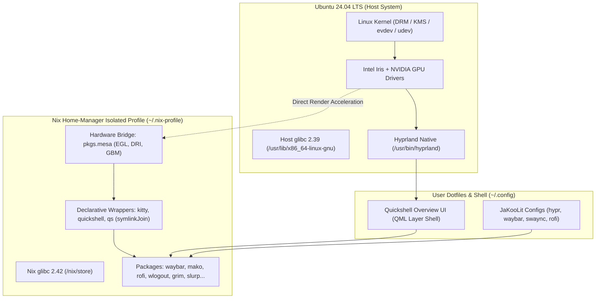

# Hyprland on Ubuntu 24.04 LTS (Nix-Isolated Desktop)

[-E95420?style=for-the-badge&logo=ubuntu&logoColor=white>)](https://ubuntu.com/)
[](https://hyprland.org/)
[](https://nixos.org/)
[](https://wayland.freedesktop.org/)
[](#)

> **Mô hình máy tính để bàn lai (Hybrid Isolated Desktop):** Tận dụng tối đa hiệu năng phần cứng gốc của Ubuntu 24.04 LTS kết hợp tầng người dùng cô lập hoàn toàn bằng Nix Home-Manager nhằm ngăn chặn 100% nguy cơ xung đột phụ thuộc (Zero APT Pollution) và hỗ trợ rollback tức thì.

---

## 📖 Giới Thiệu (Overview)

Việc cài đặt **Hyprland** (cùng toàn bộ hệ sinh thái thanh điều hướng, menu, daemon thông báo, terminal) trực tiếp trên Ubuntu 24.04 LTS qua các kho PPA truyền thống hoặc tự biên dịch thường gây ra rủi ro vỡ thư viện hệ thống (`libc`, `glibc`, thư viện đồ họa Mesa/Wayland).

Kho lưu trữ này cung cấp giải pháp kiến trúc và tài liệu hướng dẫn hoàn chỉnh để:

1. **Chạy Hyprland native trên Ubuntu Host:** Tận dụng trực tiếp Linux Kernel (6.8+), driver GPU (Intel Iris Xe + NVIDIA Proprietary), backend DRM/KMS và Aquamarine.
2. **Cô lập toàn bộ hệ sinh thái UI trong Nix Home-Manager:** 15 packages (Waybar, Quickshell, Kitty, Rofi, Mako, Wlogout, Grim, Slurp,...) được cài đặt trong `/nix/store` độc lập với glibc riêng (`glibc 2.42-84`), giữ cho `/usr/lib` của Ubuntu sạch hoàn toàn.
3. **Cầu nối tăng tốc phần cứng (Hardware Acceleration Bridge):** Đóng gói tự động wrapper `pkgs.mesa` cho các ứng dụng Nix, giải quyết dứt điểm lỗi khởi tạo EGL/OpenGL của QtWayland trên nền tảng non-NixOS.
4. **Trải nghiệm mượt mà:** Bộ dotfiles JaKooLit Hyprland-Dots v2.3.20 kết hợp tính năng **Quickshell Window Overview** kích hoạt bằng phím tắt `Super + A` hoặc **cử chỉ vuốt 3 ngón tay** trên Touchpad.

---

## 🏛️ Sơ Đồ Kiến Trúc Hệ Thống (Architecture)



---

## 📚 Hệ Thống Tài Liệu Chuyên Sâu (Documentation Index)

Toàn bộ quy trình từ kiến trúc, cấu hình, xử lý sự cố đến bảo trì dài hạn được chia thành 5 báo cáo chi tiết:

| Báo Cáo | Tài Liệu                                                                                                 | Tóm Tắt Nội Dung                                                                                                                                                  |
| :-----: | :------------------------------------------------------------------------------------------------------- | :---------------------------------------------------------------------------------------------------------------------------------------------------------------- |
| **01**  | [**Kiến Trúc Hệ Thống & Mô Hình Cô Lập**](docs/reports/01_SYSTEM_ARCHITECTURE.md)                        | Phân tích cơ chế cô lập glibc giữa Nix và Ubuntu, ranh giới dynamic linker, phần cứng GPU Hybrid và thiết lập màn hình kép.                                       |
| **02**  | [**Danh Mục Package & Hệ Sinh Thái Giao Diện**](docs/reports/02_PACKAGES_AND_ECOSYSTEM.md)               | Chi tiết 15 gói phần mềm trong `home.nix`, vai trò từng thành phần, cấu trúc bộ dotfiles JaKooLit v2.3.20 và cây thư mục `~/.config/`.                            |
| **03**  | [**Hướng Dẫn Cấu Hình Từng Bước Từ Con Số 0**](docs/reports/03_SETUP_AND_ISOLATION_GUIDE.md)             | **Cẩm nang triển khai thực tế**: Cài đặt Hyprland native, font chữ, thiết lập Nix Home-Manager, áp dụng declarative wrapper và đồng bộ giao diện.                 |
| **04**  | [**Xử Lý Xung Đột & Tối Ưu Hóa Ổn Định**](docs/reports/04_TROUBLESHOOTING_AND_STABILITY.md)              | Phân tích chuyên sâu các sự cố thực tế: Lỗi khởi tạo EGL OpenGL của Quickshell, xung đột PID với binary `.quickshell-wra` của Nix, và cách ly Waybar đa màn hình. |
| **05**  | [**Hướng Dẫn Nâng Cấp, Bảo Trì & Duy Trì Độ Ổn Định**](docs/reports/05_MAINTENANCE_AND_UPGRADE_GUIDE.md) | Quy trình nâng cấp gói Nix an toàn, kiểm tra dry-run, cơ chế rollback tức thì về thế hệ trước, dọn rác `/nix/store` và quản lý cập nhật APT/DKMS.                 |

---

## ⚡ Bắt Đầu Nhanh (Quick Start Summary)

Dưới đây là tóm tắt quy trình 6 bước để tái lập môi trường trên máy Ubuntu 24.04 sạch _(chi tiết từng dòng lệnh vui lòng xem tại [Báo Cáo 03](docs/reports/03_SETUP_AND_ISOLATION_GUIDE.md))_:

### 1. Cài đặt Hyprland Native & Font

```bash
sudo add-apt-repository -y ppa:cppiber/hyprland
sudo apt update
sudo apt install -y hyprland xdg-desktop-portal-hyprland hypridle hyprlock sway-notification-center policykit-1-gnome

# Cài đặt JetBrainsMono Nerd Font (bắt buộc cho icon JaKooLit)
mkdir -p ~/.local/share/fonts && cd /tmp
curl -OL https://github.com/ryanoasis/nerd-fonts/releases/latest/download/JetBrainsMono.tar.xz
tar -xf JetBrainsMono.tar.xz -C ~/.local/share/fonts/ && fc-cache -fv
```

### 2. Cài đặt Nix & Home-Manager

```bash
sh <(curl -L https://nixos.org/nix/install) --daemon
. /etc/profile.d/nix.sh
nix-channel --add https://github.com/nix-community/home-manager/archive/master.tar.gz home-manager
nix-channel --update
nix-shell '<home-manager>' -A install
```

### 3. Khai báo Declarative Wrapper trong `home.nix`

Tạo file `~/.config/home-manager/home.nix` khai báo các gói phần mềm và bọc sẵn biến môi trường Mesa:

```nix
{ config, pkgs, ... }:
let
  makeGpuWrapper = pkg: bin: pkgs.symlinkJoin {
    name = "${pkg.name}-wrapped";
    paths = [ pkg ];
    buildInputs = [ pkgs.makeWrapper ];
    postBuild = ''
      wrapProgram $out/bin/${bin} \
        --prefix LD_LIBRARY_PATH : "${pkgs.mesa}/lib" \
        --set LIBGL_DRIVERS_PATH "${pkgs.mesa}/lib/dri" \
        --set GBM_BACKENDS_PATH "${pkgs.mesa}/lib/gbm"
    '';
  };
in {
  home.username = builtins.getEnv "USER";
  home.homeDirectory = builtins.getEnv "HOME";
  home.stateVersion = "24.05";

  home.packages = with pkgs; [
    (makeGpuWrapper kitty "kitty")
    (makeGpuWrapper quickshell "quickshell")
    waybar mako fuzzel fastfetch rofi pamixer brightnessctl wlogout grim slurp swappy wl-clipboard mesa
  ];
  programs.home-manager.enable = true;
}
```

Kích hoạt môi trường:

```bash
home-manager switch
```

### 4. Triển khai Giao Diện JaKooLit & Quickshell Overview

```bash
git clone --depth=1 https://github.com/JaKooLit/Hyprland-Dots.git ~/Downloads/Hyprland-Dots
cp -r ~/Downloads/Hyprland-Dots/config/{hypr,waybar,swaync,rofi,kitty} ~/.config/
mkdir -p ~/.config/quickshell/overview
cp -r ~/Downloads/Hyprland-Dots/config/quickshell/* ~/.config/quickshell/overview/ 2>/dev/null || true
chmod +x ~/.config/hypr/scripts/*.sh ~/.config/hypr/UserScripts/*.sh
```

### 5. Áp dụng bản vá ổn định (Crucial Fixes)

- **Vá nhận diện PID trong `OverviewToggle.sh`:**
  ```bash
  sed -i 's/pgrep -x quickshell/pgrep -f quickshell || pidof quickshell/g' ~/.config/hypr/scripts/OverviewToggle.sh
  ```
- **Khởi chạy Quickshell trong `~/.config/hypr/configs/Startup_Apps.conf`:**
  ```ini
  exec-once = env LD_LIBRARY_PATH=$HOME/.nix-profile/lib LIBGL_DRIVERS_PATH=$HOME/.nix-profile/lib/dri GBM_BACKENDS_PATH=$HOME/.nix-profile/lib/gbm qs -c overview
  ```
- **Khóa Waybar vào màn hình chính trong `~/.config/waybar/UserModules`:**
  ```json
  {
    "output": "eDP-1"
  }
  ```

### 6. Đăng nhập

Đăng xuất tài khoản Ubuntu, tại màn hình GDM nhấp vào biểu tượng bánh răng và chọn **Hyprland**.

---

## ⌨️ Bảng Phím Tắt & Thao Tác Cử Chỉ (Keybindings & Gestures)

| Phím Tắt / Cử Chỉ                        | Chức Năng                        | Ghi Chú                          |
| :--------------------------------------- | :------------------------------- | :------------------------------- |
| **`Super + A`**                          | **Mở/Đóng Window Overview**      | Giao diện thẻ bài chọn cửa sổ    |
| **Vuốt 3 ngón tay lên** _(Touchpad)_     | **Mở/Đóng Window Overview**      | Tích hợp cử chỉ cảm ứng mượt mà  |
| **`Super + Enter`**                      | Mở Terminal Kitty                | Sử dụng wrapper Nix tăng tốc GPU |
| **`Super + Q`**                          | Đóng cửa sổ đang chọn            | Kill active window               |
| **`Super + Space`** hoặc **`Super + D`** | Mở Menu ứng dụng (Rofi / Fuzzel) | Tìm kiếm & chạy ứng dụng         |
| **`Super + M`**                          | Mở Menu Nguồn & Đăng xuất        | Wlogout                          |
| **`Super + Print`** / **`Print`**        | Chụp màn hình vùng chọn          | Grim + Slurp + Swappy            |
| **`Super + E`**                          | Mở trình quản lý tệp tin         | File Manager                     |
| **`Super + 1 -> 9`**                     | Chuyển đổi giữa các Workspace    | Workspace navigation             |

---

## 🛠️ Vận Hành & Quản Trị Hệ Thống (Maintenance Cheat Sheet)

```bash
# 1. Áp dụng thay đổi cấu hình phần mềm mới
home-manager switch

# 2. Xem lịch sử các thế hệ (Generations)
home-manager generations

# 3. Rollback tức thì về thế hệ trước khi gặp lỗi
~/.local/state/nix/profiles/home-manager-<ID>-link/activate

# 4. Kiểm tra trước thay đổi mà không áp dụng (Dry-run)
home-manager build

# 5. Dọn dẹp các thế hệ cũ và giải phóng dung lượng ổ cứng
nix-collect-garbage -d
```

---

## 🌟 Ưu Điểm Đột Phá Của Mô Hình

- **Miễn nhiễm hoàn toàn với Dependency Hell:** Nâng cấp Ubuntu hay nâng cấp gói Nix đều độc lập, không phá vỡ liên kết chéo.
- **Rollback trong 2 giây:** Khi một gói phần mềm giao diện bị lỗi, chỉ cần kích hoạt generation trước đó mà không cần cài đặt lại.
- **Tốc độ khung hình tối đa:** Không bị suy hao hiệu năng do Hyprland và Aquamarine chạy trực tiếp trên bare-metal Linux Kernel của Ubuntu.

---

## 🤝 Lời Cảm Ơn (Credits & Acknowledgments)

- [Hyprland](https://github.com/hyprwm/Hyprland) - Dynamic tiling Wayland compositor.
- [Nix & Home-Manager](https://github.com/nix-community/home-manager) - Declarative package management.
- [JaKooLit Hyprland-Dots](https://github.com/JaKooLit/Hyprland-Dots) - Tuyệt phẩm cấu hình giao diện Hyprland phong phú.
- [Quickshell](https://git.outfoxxed.me/outfoxxed/quickshell) - Flexible Wayland desktop shell scripting framework.
- [cppiber/hyprland PPA](https://launchpad.net/~cppiber/+archive/ubuntu/hyprland) - Gói dựng Hyprland tương thích Ubuntu Noble.

---

## 📄 Giấy Phép (License)

Dự án và toàn bộ tài liệu được phát hành dưới giấy phép [MIT License](LICENSE).
