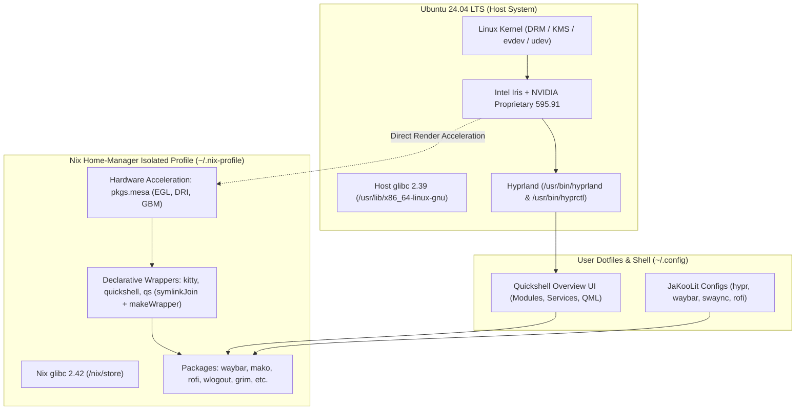

# Báo Cáo 01: Kiến Trúc Hệ Thống & Mô Hình Cô Lập (System Architecture & Isolation)

---

## 1. Tổng Quan Kiến Trúc (Architecture Overview)

Hệ thống desktop hiện tại của bạn là mô hình **Desktop Environment Lai (Hybrid Isolated Desktop Environment)**:

- **Hệ điều hành nền tảng (Host OS):** Ubuntu 24.04 LTS (Noble Numbat), Linux Kernel 6.8+.
- **Trình quản lý cửa sổ (Wayland Compositor):** Hyprland v0.56.2+ (chạy native trên host qua backend Aquamarine để tận dụng tối đa driver DRM/KMS của phần cứng).
- **Tầng cô lập ứng dụng (Isolation Layer):** Nix Package Manager + Nix Home-Manager (Quản lý toàn bộ thanh bar, terminal, app launcher, notification daemon, widget shell mà không can thiệp vào `apt` hay thư viện hệ thống `/usr/lib`).
- **Giao diện người dùng (UI Ecosystem):** JaKooLit Hyprland-Dots (v2.3.20) kết hợp Quickshell Overview (QML/C++ Wayland Layer Shell).

## 2. Bản Chất Của Cơ Chế Cô Lập Nix Trên Ubuntu (Non-NixOS)

1. **Nguyên tắc "Zero APT Pollution":**
   - Thay vì phải chạy `sudo apt install` hàng chục gói PPA hoặc tự build thủ công có nguy cơ xung đột dependency làm hỏng Ubuntu, toàn bộ các công cụ giao diện được quản lý hoàn toàn độc lập bởi Nix.
   - Thư mục hệ thống `/usr/lib`, `/etc` của Ubuntu được giữ sạch 100%.

2. **Cách ly glibc hoàn toàn (Glibc Boundary):**
   - Ubuntu 24.04 sử dụng `glibc 2.39`.
   - Các gói cài đặt qua Nix Home-Manager sử dụng `glibc 2.42-84` nằm riêng trong `/nix/store/lm3pknxi0ipypy3lxh1wmm8wvvavdwrn-glibc-2.42-84/`.
   - Các binary trong `/nix/store` được gắn cứng (hardcoded RPATH) trỏ đến dynamic loader và thư viện của Nix, không phụ thuộc vào thư viện của Ubuntu.

3. **Quản lý cấu hình dạng Declarative (Khai báo trạng thái):**
   - File cấu hình gốc nằm tại [`~/config/home-manager/home.nix`](~/.config/home-manager/home.nix).
   - Mỗi lần chạy lệnh `home-manager switch`, một thế hệ (generation) mới được tạo ra trong `~/nix-profile/`. Nếu có bất kỳ sự cố nào, có thể rollback tức thì về thế hệ trước chỉ với một lệnh duy nhất.
